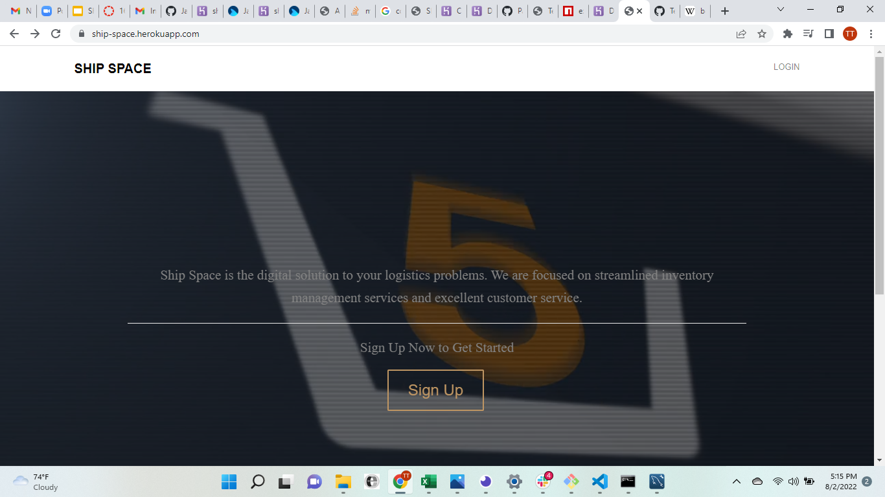

# Ship-Space

## Description

 Ship Space connects authenticated users with individual warehouses containing coffee, tea, milk, equipment, and merchanise.
 Users are promted to log in to the site or sign up to access the warehouses using their employee ID number.
 From the dashboard, users are prompted to select their desired warehouse to browse products and make a selection.

## Table Of Contents

* [Contributors](#contributors)  

* [Technologies](#technologies)

* [Screenshots](#screenshots)

* [Link](#link)

## Contributors

* Terrence Mashoro

* Jack Atkerson

* Jessica Hoffman

## Technologies

* Javascript

* SCSS

* CSS

* Express.js

* Handlebars

* MySQL

* Sequelize

* Dotenv

* Bcrypt

## Screenshots

.png)
.png)

## Link

Check out the deployed app here: [Ship Space](https://ship-space.herokuapp.com/)
